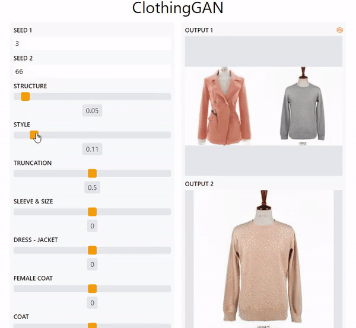

# AI Powered Clothing Design Generator
[]
[](https://huggingface.co/spaces/mfrashad/ClothingGAN)




[Devpost Link](https://devpost.com/software/clothinggan) | [Youtube Video](https://www.youtube.com/watch?v=dHuunRnMnMo)


## What it does
ClothingGAN able to generate clothing images and mix these images. While mixing, you can control which structure or style that you want the clothing to copy. Additionally, you can edit the generated clothing with several given attributes such as dark color, jacket, dress, or coat.


## Citation
```
@inproceedings{härkönen2020ganspace,
  title     = {GANSpace: Discovering Interpretable GAN Controls},
  author    = {Erik Härkönen and Aaron Hertzmann and Jaakko Lehtinen and Sylvain Paris},
  booktitle = {Proc. NeurIPS},
  year      = {2020}
}
```
